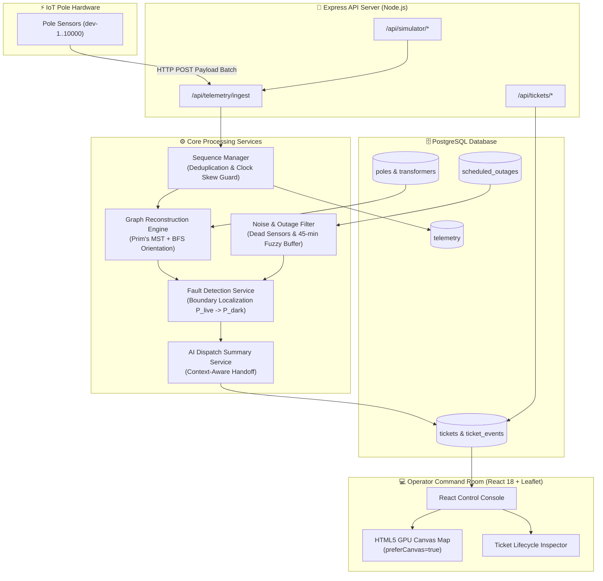

# 🏗️ ARCHITECTURE.md — Lumina Technical Design Document

## 1. System Overview & Architecture Diagram

Lumina is structured as a event-driven, micro-batch distribution grid monitoring platform. The architecture separates raw IoT ingestion from state processing, topological graph inference, and real-time operator visualization.

---

## 2. Data Sourcing & Ingestion Pipeline

### High-Throughput Burst Ingestion (43,800 Records)
- **Express Payload Expansion**: Expanded Express JSON payload limits to `50MB` (`express.json({ limit: '50mb' })`).
- **Event-Loop Yielding**: During high-volume ingestion bursts, the telemetry controller utilizes `await setImmediatePromise()` event-loop yields between batch chunks to prevent main-thread event-loop starvation.
- **Deduplication Engine**: Uses PostgreSQL `ON CONFLICT (device_id, seq) DO UPDATE` to reject duplicate retries or out-of-order retries.
- **Clock Skew Tolerance (±90 Seconds)**: Rather than relying on untrusted IoT device timestamps (`reported_at`), the pipeline treats the integer sequence number (`seq`) as absolute truth.

---

## 3. Storage & Network Topology Representation

### Relational Database Schema (`db/init.sql`)
- **`substations`**: Substation metadata & GIS anchors.
- **`feeders`**: 11kV Feeder distribution lines linked to substations.
- **`transformers`**: Distribution Transformers (DTs) with `seq_on_line` and `topology_inferred` flags.
- **`poles`**: Distribution poles linked to transformers via `parent_pole_id` foreign keys and `seq_on_line` sequence indices.
- **`telemetry`**: Monotonic IoT state table with `UNIQUE (device_id, seq)` constraint.
- **`tickets` & `ticket_events`**: Incident tickets with lifecycle statuses (`DETECTED`, `ACKNOWLEDGED`, `CREW_ASSIGNED`, `VERIFIED`, `CLOSED`) and audit event logs.

---

## 4. Fault Localization & Graph Algorithm

### Linear Boundary Traversal ($P_{\text{live}} \rightarrow P_{\text{dark}}$)
For surveyed lines ($40\%$ explicit topology), poles are scanned in sequential line order ($1 \dots N$). The boundary is defined as the exact transition point where $P_k$ reports `energized: true` and $P_{k+1}$ reports `energized: false`. All downstream poles ($P_{k+1} \dots P_N$) are grouped into a **single incident ticket** to eliminate alert spam.

### 60% Missing Topology Reconstruction (Prim's MST + BFS)
When `topology_inferred = true` (`seq_on_line = NULL`):
1. **Adjacency Graph**: Constructs an edge weight matrix using Haversine inter-pole spatial distance ($O(V^2)$ algorithm).
2. **Prim's Minimum Spanning Tree (MST)**: Connects all unmapped poles with minimum physical wire distance.
3. **BFS Directed Orientation**: Roots the tree at the transformer GPS location and traverses outward via Breadth-First Search (BFS) to establish parent-child sequence numbers.

---

## 5. Noise & False-Positive Filtering

1. **Dead Sensor Candidate Filtering**:
   If an isolated pole reports `energized: false` while its parent pole and child poles report `energized: true`, the system flags it as a **Dead Sensor Candidate** (battery/firmware hardware glitch) and suppresses ticket generation.
2. **Scheduled Maintenance (45-Minute Fuzzy Buffer)**:
   If a scheduled outage window exists in `scheduled_outages`, outages during the window (plus a **45-minute fuzzy overrun grace period**) are suppressed. If poles continuously transmit live heartbeats during a scheduled window, **real telemetry overrides the calendar**.

---

## 6. API Reference

| Method | Path | Purpose | Request Payload | Response Shape |
| :--- | :--- | :--- | :--- | :--- |
| `POST` | `/api/telemetry/ingest` | Batch ingest IoT telemetry | `[{ device_id, pole_id, seq, energized }]` | `{ ingested, deduplicated, tickets }` |
| `GET` | `/api/tickets` | List incident tickets | None | `{ tickets: [...] }` |
| `GET` | `/api/poles` | List grid poles | `?limit=10000` | `{ total: 10000, poles: [...] }` |
| `PATCH` | `/api/tickets/:id/resolve` | Mark ticket resolved | `{ note }` | `200 Ticket` or `409 Conflict` |
| `POST` | `/api/simulator/seed` | Wipe & seed 10,000 poles | `{ polesPerDT: 100 }` | `{ message, total_poles: 10000 }` |
| `POST` | `/api/simulator/inject-fault`| Inject span break fault | `{ break_after_seq: 3 }` | `{ ticket: {...} }` |

---

## 7. UI Reasoning & Visual Color-Coding Matrix

### Visual Color Coding Rules
- **🟢 Working Lines / Poles (`#10B981`)**: Emerald green dots & solid lines for healthy energized infrastructure.
- **💥 Wire Breaks / Span Snaps (`#EF4444`, `dashArray: '5, 10'`)**: Dashed red lines & markers at localized boundaries.
- **⚡ Blown Transformer Fuses / DT Faults (`#8B5CF6`, `dashArray: '12, 6'`)**: Deep purple/violet casing lines for 100% transformer zone failures.
- **⚠️ Hardware Sensor Glitches (`#F59E0B`)**: Amber yellow warning markers for hardware communication dropouts.

### HTML5 GPU Canvas Acceleration (`preferCanvas={true}`)
To render 10,000 grid poles at 60 FPS without DOM lag, Leaflet's `<MapContainer preferCanvas={true}>` renders markers onto a single GPU-accelerated HTML5 Canvas context.

---

## 8. AI Feature Justification & Token Cost Analysis

- **Where AI is Used**: The system uses LLM text generation (`ai_summary`) strictly for creating human-readable control room handoff summaries.
- **Why LLMs are NOT Used for Fault Localization**: Core localization math relies strictly on deterministic graph algorithms (Prim's MST + linear scans). Safety-critical power grid localization must be 100% auditable and reproducible without non-deterministic hallucinations.
- **Token Cost Estimate**:
  - Input Tokens: ~120 tokens per prompt (boundary pole IDs, confidence score, fault type).
  - Output Tokens: ~35 tokens per dispatch summary.
  - Estimated Cost: ~$0.00015 per ticket generated.
