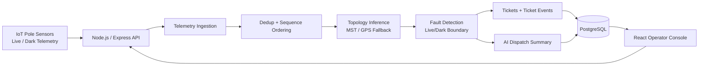

# Architecture

## System Overview

## Ingestion Pipeline

The telemetry API is designed to accept bursts of up to 5,000 messages in 10 seconds. The ingest path is:

1. Accept a batch payload from the frontend or simulator.
2. Normalize message shape to a consistent internal structure.
3. Deduplicate by `device_id + seq` so repeated deliveries do not create duplicate state.
4. Sort or compare by `seq` instead of timestamp to avoid clock-skew problems.
5. Persist the deduplicated telemetry to PostgreSQL.
6. Group the messages by transformer and run fault detection per radial line.

The sequence number is treated as the source of truth because device clocks can drift by roughly ±90 seconds.

## Localization Algorithm

The localization logic follows the radial-tree assumption used in the assignment.

1. Order poles along the line.
2. Evaluate pole liveness in sequence order.
3. Find the last live pole and the first dark pole.
4. Treat that transition as the live/dark boundary.
5. Group all downstream dark poles into the same ticket.

The traversal is linear in the size of the line. In graph terms, the detection work is $O(V+E)$ for the topology you reconstruct and then scan.

The system does not create one ticket per dark pole. It creates one ticket per localized fault boundary so the control room does not receive alert spam for the same wire break.

## Missing Topology Handling

The brief states that a large portion of transformer topology data is missing. When `seq_on_line` or `parent_pole_id` is unavailable, the backend infers a line order geometrically.

Approach used:

- Measure inter-pole distances using GPS coordinates.
- Build a minimum spanning tree from the pole locations.
- Choose a root pole near the transformer location.
- Orient the tree outward to produce an approximate radial sequence.

This fallback is marked as inferred in the UI and in the ticket metadata.

## Noise and False-Positive Filtering

Two filters are used before a fault becomes a ticket:

- A single dark pole with live neighbors is treated as a dead sensor candidate and ignored.
- Scheduled outages are checked through the mock outage API and filtered out so load shedding does not create false tickets.

## API Endpoints

| Method | Endpoint                       | Purpose                             | Response Shape                                        |
| ------ | ------------------------------ | ----------------------------------- | ----------------------------------------------------- |
| GET    | `/api/telemetry/health`        | Health check for ingestion service  | `{ status }`                                          |
| POST   | `/api/telemetry/ingest`        | Ingest telemetry batch              | `{ ingested, deduplicated, detectedFaults, tickets }` |
| GET    | `/api/tickets`                 | List tickets                        | `{ tickets }`                                         |
| GET    | `/api/tickets/:id`             | Get one ticket                      | `{ ticket }`                                          |
| PATCH  | `/api/tickets/:id/acknowledge` | Move ticket to acknowledged         | `{ ticket }`                                          |
| PATCH  | `/api/tickets/:id/assign`      | Assign a crew                       | `{ ticket }`                                          |
| PATCH  | `/api/tickets/:id/resolve`     | Mark resolved after telemetry check | `{ ticket }` or `409`                                 |
| PATCH  | `/api/tickets/:id/verify`      | Verify restoration from telemetry   | `{ ticket }` or `409`                                 |
| PATCH  | `/api/tickets/:id/close`       | Close verified ticket               | `{ ticket }` or `409`                                 |
| POST   | `/api/simulator/scenario`      | Create a full synthetic scenario    | `{ scenario }`                                        |
| POST   | `/api/simulator/seed`          | Seed a synthetic line               | `{ scenario }`                                        |
| POST   | `/api/simulator/inject-fault`  | Inject a synthetic fault            | `{ telemetry }`                                       |
| GET    | `/api/simulator/outages`       | List active mock outages            | `{ outages }`                                         |
| POST   | `/api/simulator/outages`       | Create a mock outage                | `{ outage }`                                          |

## AI Feature Justification

The AI-shaped feature in this project is the dispatch summary for localized tickets.

Why it belongs:

- It summarizes existing structured data into a short operator handoff.
- It does not affect the correctness of fault detection.
- It helps the control room translate a localized fault into field instructions faster.

Why an LLM is not used for fault math:

- Localization must be deterministic and auditable.
- Graph traversal and boundary detection should be explainable and testable.
- LLM output would be too unstable for the core safety-critical decision.
